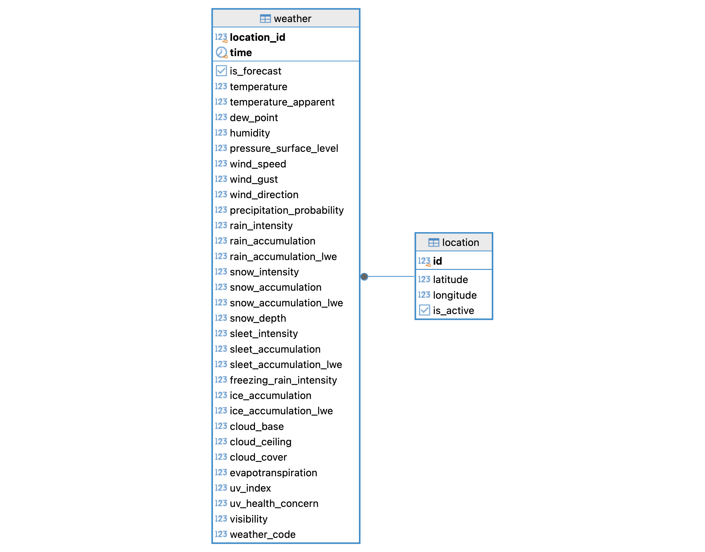

# Tomorrow.io Weather Data Scraper

This project is a lightweight system that scrapes the Tomorrow.io API for weather data. It gathers both forecast and recent historical data for a set of geographic locations. These data are stored in a PostgreSQL database that is available for querying.

## Usage

1. Clone the repository:

   ```console
   git clone https://github.com/BrunoGrandePhD/tomorrow-scraper.git
   cd tomorrow-scraper
   ```

2. Create a `.env` file in the root directory and update the value of `TOMORROW_API_KEY` with your Tomorrow.io API key:

   ```console
   cp .env.example .env
   ```

3. Build and start the containers:

   ```console
   docker compose up --build
   ```

   **N.B.** The `docker compose` command assumes that you have the `compose` subcommand available. If not, you can use `docker-compose` instead.

4. Access the [`analysis.ipynb`](http://127.0.0.1:8888/notebooks/analysis.ipynb) Jupyter notebook to visualize the results. 

   **N.B.** You can re-run the notebook to re-generate the output, but you need to wait until the `tomorrow` container has finished running its initial scrape, which should take less than a minute.

5. Clean up the system after stopping the containers using Ctrl+C:

   ```console
   docker compose down --volumes
   ```

## Database Schema



## Decisions and Rationale

In general, I opted for a simple design that would answer the questions posed in the assignment. In a production setting (or with more information on future requirements), I would revisit many of these decisions.

- **Separate `locations` table:** This table is seeded with the locations specified in the assignment (see `scripts/init-db.sql`). The scraper uses the locations stored in this table that are marked as "active" when fetching data from the Tomorrow.io API.

- **Using `DECIMAL` for latitude and longitude:** I used the number of significant digits in the assignment instructions to determine the precision of the `latitude` and `longitude` fields. This could be revisited if more precision is needed in the future.

- **Combined `weather` table:** Forecast and historical weather data from Tomorrow.io share the same set of fields, so this table stores both types of data. The `is_forecast` boolean field is used to differentiate between the two. This approach simplified the querying logic needed to answer the second question in the assignment. If we expect the fields to diverge between the two types of data, we could use separate tables.

- **Upserts for `weather` table:** While time series data is amenable to being appended to a table, I opted for upserts because the questions in the assignment wouldn't benefit from preserving outdated forecast data. While upserts are slightly more complicated during writes, they simplify the querying logic when retrieving the data.

- **Composite key for the `weather` table:** I opted for a composite key instead of a surrogate key to simplify the upsert queries. Namely, using `(location_id, time)` as the composite key allows the insertion of historical data to naturally update the forecast data as it becomes available. The presence of the indexed `is_forecast` boolean field allows the user to quickly filter for forecast or historical data.

- **Individual `weather` fields:** I assumed that the Tomorrow.io API is relatively stable, so I opted for individual fields for each weather variable, which affords easier querying and better data integrity. If the API is unstable (or simply adds new variables over time), we could store the data in a JSONB column or in a NoSQL database.

- **Using `REAL` for numeric fields:** I wasn't able to find documentation on the expected data types and precision for the numeric values returned by the Tomorrow.io API. Through trial and error, I found that most values that appeared as integers could also be decimal numbers. I opted for `REAL` since it provides a good balance between precision and storage size. If more precision is needed, we could use `DECIMAL` or `DOUBLE PRECISION` columns.

- **Dataclass models:** For larger projects, I would consider using SQLAlchemy or another Object-Relational Mapping (ORM) library. However, for this small project, I opted for dataclasses since they are simple and easy to understand. The `dataclasses_json` library provided additional functionality for converting to and from JSON as well as automatically mapping camel case to snake case.

- **Cron for task scheduling:** I considered using a workflow management system like Airflow or Prefect, but I hesitated because it seemed like overkill for a docker-compose setup. Given the small scope of the project, I opted for a simple cron job. I acknowledge the limitations of cron, such as limited flexibility, support for monitoring, and retries. In a production setting, I would use a workflow management system like Airflow or Prefect.

- **Limited support for rate limits:** The Tomorrow.io API has rate limits, especially for tokens on the free API plan. I added some rate limiting to avoid making more than two requests per second (the limit is three). The hourly rate limit is more challenging to handle, especially since the API doesn't provide a `Retry-after` header. I assumed that this system would be run using a token on a paid plan with a higher rate limit. If rate limits were still a concern, we could look into using the `backoff` Python [package](https://pypi.org/project/backoff/) to implement exponential backoff.

- **Continuous updates of historical data:** I opted to continuously update historical weather data in case the Tomorrow.io API provides updated values. If historical data is known to be fixed, then we could avoid updating existing values by filtering for timestamps that don't already exist in the database.

- **Unit and integration tests:** I aimed to strike a balance between unit and integration tests. I use mocking sparingly to avoid over-coupling the tests to the implementation details. For example, I implemented `InMemoryWeatherDB` to act as a stub of the `PostgreSQLWeatherDB` class. I designed the classes to use dependency injection to facilitate the use of test doubles. I marked integration tests with the `@pytest.mark.integration` marker so they can be run conditionally (_e.g._ when the PostgreSQL container is available and the Tomorrow.io API key is provided). I use the `pytest-postgresql` package to isolate tests that interact with the PostgreSQL container.

## Future Improvements

If I were to continue working on this project, I would consider the following improvements:

- Create a real Python package with a `pyproject.toml` file and an associated package lock file for reproducibility.
- Separate some dependencies into optional extras to reduce the overall package size, such as `dev` and `test`.
- Set up the repository to use the same container definition for development (_e.g._ using Dev Containers) and deployment.
- Implement a command-line interface with additional functionality (_e.g._ adding new locations).
- Switch to using SQLAlchemy for defining the database models, creating the tables, performing the queries, and allowing users to interact with the database via Python objects instead of raw SQL.

## Development

### Testing

To run the test suite, install the dependencies in a virtual environment and run `pytest` in the project root:

```console
python -m venv .venv
source .venv/bin/activate
python -m pip install -r requirements.txt

pytest
```

### Linting

To run `ruff` on the project source code, run the following command in the project root:

```console
ruff check .
```

### Static Type Checking

To run `mypy` on the project source code, run the following command in the project root:

```console
mypy .
```
